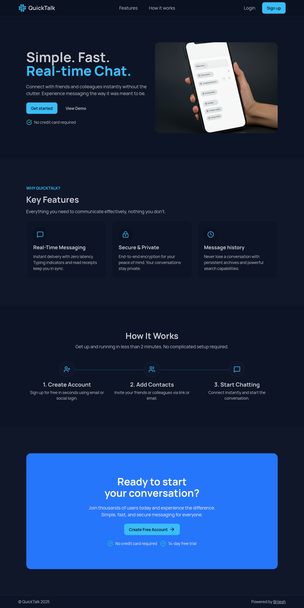
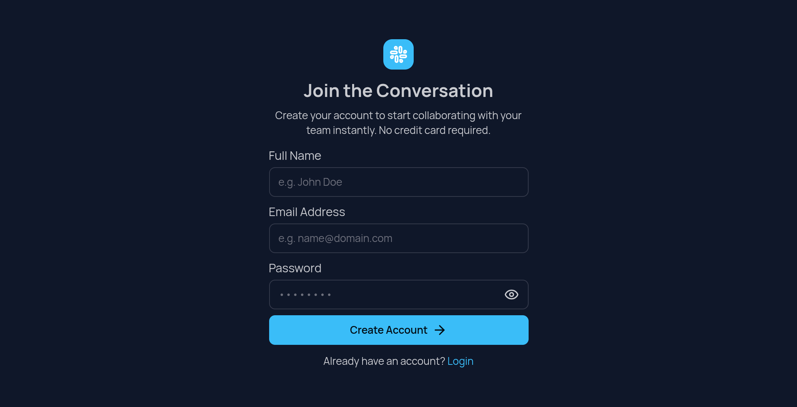
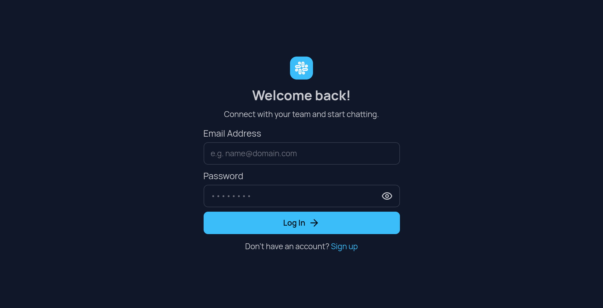
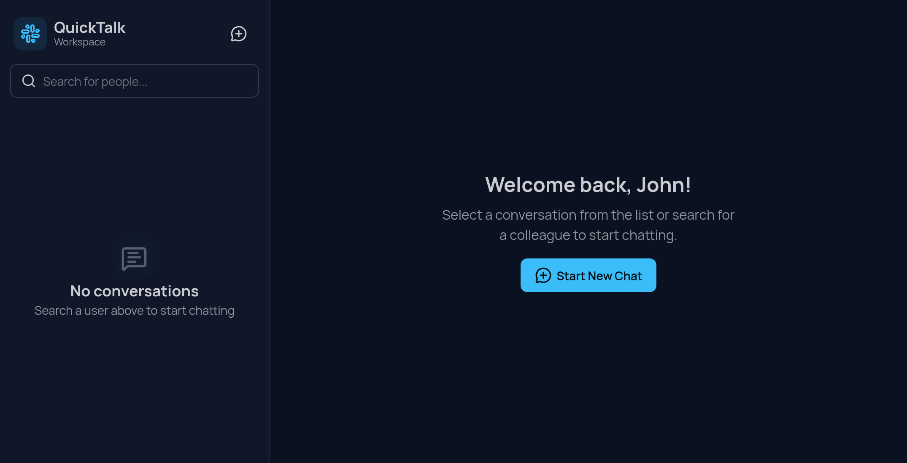
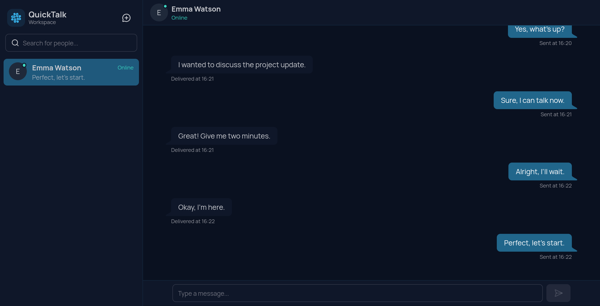

# QuickTalk 💬

**Real-time 1-to-1 chat application**

QuickTalk is a lightweight, real-time chat application inspired by WhatsApp-style conversations.  
It focuses on **core chat reliability**, **clean UX**, and **real-time presence**, without unnecessary complexity.

---

## 🚀 Features

### 🔐 Authentication

- User signup & login
- Secure JWT-based authentication
- Protected routes

---

### 💬 Real-Time Messaging

- 1-to-1 live chat
- Messages delivered instantly using WebSockets
- Messages persist after refresh

---

### 🧑‍🤝‍🧑 Add Users (Contacts)

- Search users by email / username
- Start a new conversation instantly
- Prevent duplicate chats

---

### 🟢 Online / Offline Presence

- Live online status
- Automatic offline detection on disconnect
- Real-time status updates

---

### 📂 Sidebar Chat List

- Recent conversations
- Sorted by last activity
- Displays last message preview

---

### 🧭 Thoughtful UX States

- Welcome screen when no chat is selected
- Empty chat state for new conversations
- Loading states for messages
- No-user-found feedback while searching

---

## 🖥️ Pages & Screenshots

### 🏠 Landing Page

Simple marketing page explaining the app.



---

### 🔑 Signup Page

Create a new account securely.



---

### 🔐 Login Page

Authenticate and access the app.



---

### 👋 Welcome / Empty State

Displayed when no chat is selected.



---

### 💬 Chat Page

Real-time conversation view with message input.



---

## 🧱 Tech Stack

### Frontend

- React.js
- TypeScript
- Tailwind CSS + DaisyUI
- Axios
- Tanstack/react-query
- WebSocket client

### Backend

- Node.js
- NestJS
- MongoDB + Mongoose
- JWT Authentication
- WebSockets (real-time messaging)

---

## ⚙️ Core Concepts Implemented

- Real-time communication using WebSockets
- JWT-secured socket connections
- Conversation-based message modeling
- Clean separation of REST & socket logic
- Persistent chat history
- Online/offline presence tracking

---

## 📦 Installation & Setup

```bash
# Clone the repository
git clone https://github.com/brijeshdevio/quick-talk.git

# Frontend
cd quick-talk/client
npm install
npm run dev

# Backend
cd ../server
npm install
npm run start:dev
```

> Make sure MongoDB is running and environment variables are configured.

---

## 🛣️ Future Enhancements (Planned)

- Message delivery & read receipts
- Typing indicators
- Group chats
- Media sharing
- Push notifications

---

## 👨‍💻 Author

**Brijesh**
Frontend-focused Full Stack Developer

- GitHub: [@brijeshdevio](https://github.com/brijeshdevio)

---

## ⭐️ Support

If you find this project useful, please consider giving it a **star ⭐**
It helps a lot and motivates further development.
